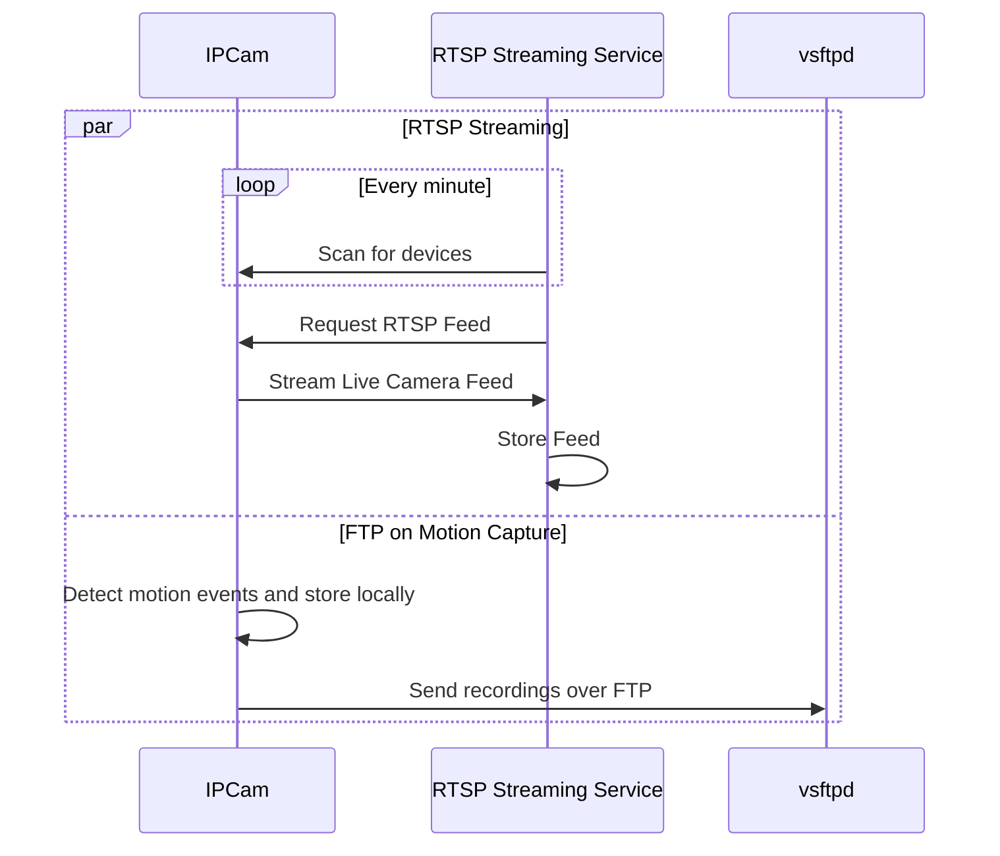
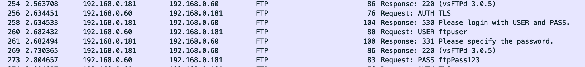
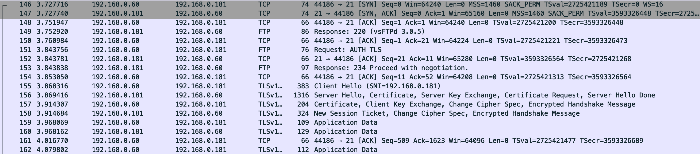

# NVR

This VM is set up to act as a NVR (network video recorder) to stream and backup footage from IP cameras around the house. This allows me to disable the default WAN access to the cameras and replaces the use of a cloud service and allows me to manage my own storage schedule for the the recordings.

There are two main functionalities this server supports:

- FTP transfer of motion capture events - short clips triggered by activity
- RTSP stream of 24/7 footage




## RTSP Stream

:::info
TODO - WIP
:::

## FTP on Motion Capture

### Overview

I am using IP cameras outside my house that can communicate via FTP to send motion capture events to a computer on my network. This is handy because it saves me the headache of needing to add a motion detection capability to my RTSP streaming service. 

### Configuration and Security Concerns

I chose [vsftpd](https://security.appspot.com/vsftpd.html#about) as my FTP server as it is the [default recommendation](https://documentation.ubuntu.com/server/how-to/networking/ftp/) for Ubuntu servers. While I have read that sftp is more secure, the IP cameras I am working with don't support it and the communication should be restricted to my local network so I want to explore if there is a secure way to approach this with FTP.

The very first choice you need to make is whether to use anonymous or authenticated users. At a glance authenticated users seemed to be the safer route for me. I imagined I could set up a device specific user on the machine, provide a username and password and scope permission appropriately so that the user can only write files to the intended directory on the device.

But the Ubuntu docs say different:

> In the Anonymous mode, remote clients can access the FTP server by using the default user account called “anonymous” or “ftp” and sending an email address as the password. In the Authenticated mode a user must have an account and a password. This latter choice is very insecure and should not be used except in special circumstances. 

Huh, well that sure seems counterintuitive. But after a quick spin around Google I came across this [thread](https://security.stackexchange.com/questions/191900/how-insecure-is-ftp) that did a good job of summarizing concerns.

Primarily, FTP sends eveything in plaintext by default, so if you are using an authenticated user...



...your credentials are transmitted in plaintext by default. Yowza.

I don't exactly want to set up this server to allow anonymous writes over the network either, so it's time to do a bit of hardening.

#### Disable Anonymous Users

I don't want to allow anonymous reads or writes so I am disabling this functionality.

```
anonymous_enable=NO
anon_upload_enable=NO 
anon_mkdir_write_enable=NO
```

#### Enable FTPS

Now let's set up FTPS to take care of the passing credentials in cleartext problem.

```sh
# encrypted connections - these certs are no good for prod but should be fine for home traffic
rsa_cert_file=/etc/ssl/certs/ssl-cert-snakeoil.pem
rsa_private_key_file=/etc/ssl/private/ssl-cert-snakeoil.key
# enable ssl/tls 
ssl_enable=YES
# disallow anon access
allow_anon_ssl=NO
# force ssl connections for data transfer
force_local_data_ssl=YES
# force ssl connections for login
force_local_logins_ssl=YES
# enable secure tls version
ssl_tlsv1=YES
# disble insecure older versions
ssl_sslv2=NO
ssl_sslv3=NO
```

And after FTPS is set up my network chatter is starting to look more secure (albeit to my inexperienced eyes - this is my first time using WireShark).




#### chroot User

I don't want my user to have access to any files beyond their home directory. I am using the following settings.

```
chroot_local_user=YES
hide_ids=YES           # prevents leaking user info
```

Due to the [Roaring Beast attack](https://serverfault.com/questions/743949/vsftp-why-is-allow-writeable-chroot-yes-a-bad-idea) I follow the recommendation to only make subdirectories below the FTP user's home directory writeable to the user and intentionally do not enable `allow_writeable_chroot`.

#### Firewall Other Network Devices

As an additional precaution I've enabled the Proxmox firewall for this VM to DROP all incoming traffic by default. This allows me to restrict access to port 21 for FTP to select IPs.

#### References 

- [Rocky Linux - Secure FTP Server - vsftpd](https://docs.rockylinux.org/guides/file_sharing/secure_ftp_server_vsftpd)
- [Ubuntu- Set up an FTP server](https://documentation.ubuntu.com/server/how-to/networking/ftp/)
- [OpenAI - Deep Research](./notes/deep-research-vsftpd.md)
