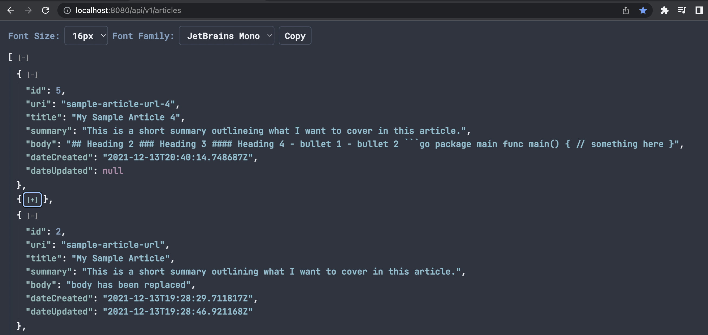

# JSON Formatter Chrome Extension

**Repo:** https://github.com/James-D-Wood/json-format-chrome-extension

This project was to make a clone of Callum Locke's popular
[JSON Formatter](github.com/callumlocke/json-formatter) web extension and put
my own spin on it by adding a font selector feature.

The goal of the project was to reproduce without looking at the source code in
order to compare the two approaches at the end. This was written in one sitting
on a 12 hour flight so the goal was to keep the solution as simple as possible.

My solution has type specific syntax highlighting, imports multiple fonts and
enables the user to toggle font size, can collapse nested objects and arrays
and has a convenient copy button (mostly because I ran out of time to solution
a way around the collapse buttons during manual highlight, copy and paste).
