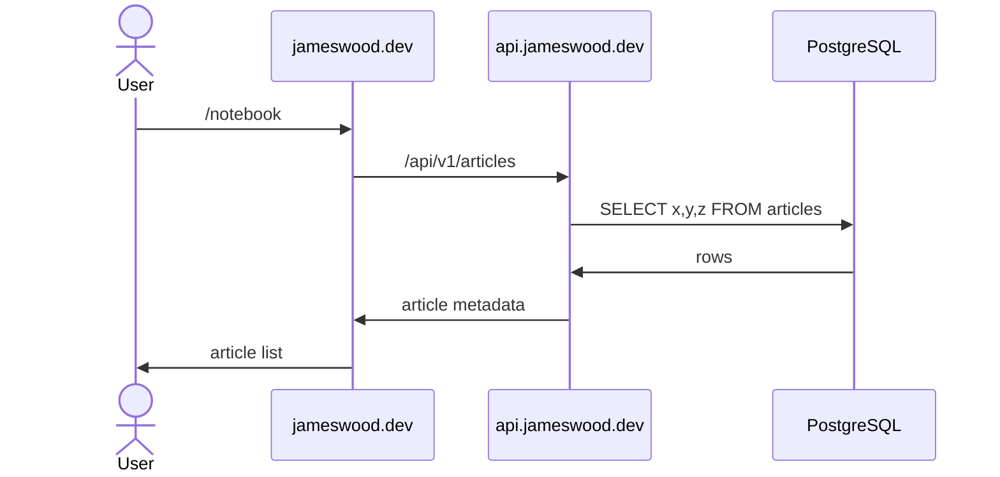

# Blog

## jameswood.dev

For now I'm including a couple trivial examples to take up space and show the
mermaid capabilities.

### Listing Blogs

```mermaid
sequenceDiagram
    actor User
    participant FE as jameswood.dev
    participant BE as api.jameswood.dev
    participant DB as PostgreSQL

    User ->> FE: /notebook
    FE ->> BE: /api/v1/articles
    BE ->> DB: SELECT x,y,z FROM articles
    DB ->> BE: rows
    BE ->> FE: article metadata
    FE ->> User: article list
```
