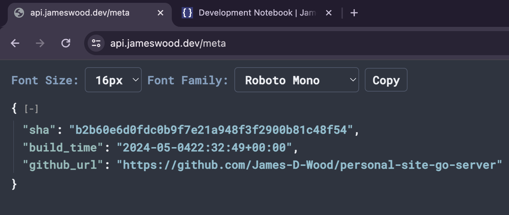

# Development Notebook

## August 9, 2025 

### Uplift Docusaurus to V3

Because I don't work day to day with the JS ecosystem, I find these major version uplifts to be a bit of a struggle because of the incompatibility between dependencies.

I am going to document this uplift process so that I have something to reference in the future. 

Before I get started, I am going to:
- enumerate my notebooks plugins and dependencies
- google some docs on how to perform the uplift
- ask Claude Code for some advice on how to proceed

#### Dependency Discovery

To enumerate dependencies, I am checking my `package.json` and `docusaurus.config.js` files for hints of potential conflicts that this update will bring.

```json title="package.json"
{
  "name": "my-website",
  "version": "0.0.0",
  "private": true,
  "scripts": {
    "docusaurus": "docusaurus",
    "start": "docusaurus start",
    "build": "docusaurus build",
    "swizzle": "docusaurus swizzle",
    "deploy": "docusaurus deploy",
    "clear": "docusaurus clear",
    "serve": "docusaurus serve",
    "write-translations": "docusaurus write-translations",
    "write-heading-ids": "docusaurus write-heading-ids",
    "typecheck": "tsc"
  },
  // highlight-start
  // theme-mermaid will likely need to be updated - this is how I am supporting diagrams
  // prism-react-renderer is how I am theming my code blocks - this will need an uplift as well
  // 
  "dependencies": {
    "@docusaurus/core": "2.2.0",
    "@docusaurus/preset-classic": "2.2.0",
    "@docusaurus/theme-mermaid": "^2.2.0",
    "@mdx-js/react": "^1.6.22",
    "clsx": "^1.2.1",
    "prism-react-renderer": "^1.3.5",
    "react": "^17.0.2",
    "react-dom": "^17.0.2"
  },
  // the TS installation may need to be uplifted in this change
  "devDependencies": {
    "@docusaurus/module-type-aliases": "2.2.0",
    "@tsconfig/docusaurus": "^1.0.5",
    "typescript": "^4.7.4"
  },
  // highlight-end
  "browserslist": {
    "production": [
      ">0.5%",
      "not dead",
      "not op_mini all"
    ],
    "development": [
      "last 1 chrome version",
      "last 1 firefox version",
      "last 1 safari version"
    ]
  },
  "engines": {
    "node": ">=16.14"
  }
}
```

```js title="docusaurus.config.js"
// highlight-start
// I'm using a custom theme here - 
// I'll need to check that this is compatible with newer versions of the dependencies
const lightCodeTheme = require("./src/themes/wisteria");
const darkCodeTheme = require("./src/themes/wisteria");
// highlight-end

/** @type {import('@docusaurus/types').Config} */
const config = {
  title: "James' Tech Notes",
  tagline: "This site is under test",
  url: "https://notebook.james.codes/",
  baseUrl: "/",
  onBrokenLinks: "throw",
  onBrokenMarkdownLinks: "warn",
  favicon: "img/favicon.ico",

  // GitHub pages deployment config.
  // If you aren't using GitHub pages, you don't need these.
  organizationName: "James-D-Wood", // Usually your GitHub org/user name.
  projectName: "James-D-Wood.github.io", // Usually your repo name.
  trailingSlash: false,
  deploymentBranch: "gh-pages",
  // Even if you don't use internalization, you can use this field to set useful
  // metadata like html lang. For example, if your site is Chinese, you may want
  // to replace "en" with "zh-Hans".
  i18n: {
    defaultLocale: "en",
    locales: ["en"],
  },

  // highlight-start
  // once again - I'll need to check for mermaid plug in compatibility
  markdown: {
    mermaid: true,
  },
  themes: ["@docusaurus/theme-mermaid"],
  //highlight-end

  presets: [
    [
      "classic",
      /** @type {import('@docusaurus/preset-classic').Options} */
      ({
        docs: {
          sidebarPath: require.resolve("./sidebars.js"),
        },
        blog: {
          showReadingTime: true,
          editUrl:
            "https://github.com/facebook/docusaurus/tree/main/packages/create-docusaurus/templates/shared/",
        },
        // highlight-start
        theme: {
          customCss: require.resolve("./src/css/custom.css"),
        },
        // highlight-end
      }),
    ],
  ],

  themeConfig:
    /** @type {import('@docusaurus/preset-classic').ThemeConfig} */
    ({
      navbar: {
        logo: {
          alt: "My Site Logo",
          src: "img/jw.png",
          href: "/docs/projects",
        },
        items: [
          {
            type: "doc",
            docId: "projects",
            position: "left",
            label: "Projects",
          },
          {
            href: "https://jameswood.dev/resume",
            position: "right",
            label: "Resume",
          },
          {
            href: "https://github.com/James-D-Wood",
            label: "GitHub",
            position: "right",
          },
        ],
      },
      footer: {
        style: "dark",
        links: [],
        copyright: `Copyright © ${new Date().getFullYear()} My Project, Inc. Built with Docusaurus.`,
      },
      // highlight-start
      prism: {
        additionalLanguages: ["swift"],
        theme: lightCodeTheme,
        darkTheme: darkCodeTheme,
      },
      // highlight-end
      colorMode: {
        defaultMode: "dark",
      },
    }),
};

module.exports = config;
```

Summary:
- prism and a custom theme are being used to handle syntax highlighting in code blocks
- mermaid is being supported via plugins for diagrams
- a custom css sheet is being used
- typescript is configured but is likely not widely used

#### Helpful Docs

- [Docusaurus Docs - Upgrading to Docusaurus v3](https://docusaurus.io/docs/migration/v3)
    - [Upgrading Dependencies](https://docusaurus.io/docs/migration/v3#upgrading-dependencies)
    - [Upgrade Node](https://docusaurus.io/docs/migration/v3#nodejs-v180)
    - [Upgrade React](https://docusaurus.io/docs/migration/v3#react-v180)
    - [Upgrade Prism](https://docusaurus.io/docs/migration/v3#prism-react-renderer-v20)
    - [Upgrade Mermaid](https://docusaurus.io/docs/migration/v3#mermaid-v104)
    - [Upgrade TypeScript](https://docusaurus.io/docs/migration/v3#typescript-v51)
- [Docusaurus Docs - Upgrading Docusaurus](https://docusaurus.io/docs/migration)
    - Use `npm run clear` to clean up artifacts and cached items
    - Use `rm -rf node_modules yarn.lock package-lock.json` to clean up deps

#### Executing the Update

In reality, this update was painless. I believe there were some extensions in my notebook at work that made this upgrade process more difficult but at least this time around the process was quite easy.

- `npm run clear`
- `rm -rf node_modules yarn.lock package-lock.json`
- Update `package.json` with dependencies as mentioned in the V3 uplift guide
- Update `tsconfig.json` to extend the new dependency name
- `npm install`

Easy peasy.

After that I bumped to the new minor version using

```bash
npm i @docusaurus/core@latest @docusaurus/preset-classic@latest @docusaurus/theme-mermaid@latest @docusaurus/module-type-aliases@latest @docusaurus/tsconfig@latest
```

## May 4, 2024

### Creating the /meta endpoint

Today I wanted to set up an endpoint to share service metadata such as commit
SHA and build time to help serve as a reminder to me when I last was working
on this project and what version of the code I had last deployed. I often go
long stretches between working on my personal projects depending on how busy
life gets and having this as quick reference helps me dive back in where I
left off.

The learning from this was how to use `go generate` in my build steps to
generate txt files with the metadata I wanted to include and use `go embed`
to tie these values to variables at runtime. The relevant code looks like
this:

```go
//go:generate sh -c "printf %s $(git rev-parse HEAD) > .build/commit.txt"
//go:generate sh -c "date -u -I seconds | tr -d '[:space:]' > .build/build-time.txt"
var (
	//go:embed .build/commit.txt
	Commit string
	//go:embed .build/build-time.txt
	BuildTime string
)

type MetaResponse struct {
	CommitSHA string `json:"sha"`
	BuildTime string `json:"build_time"`
	GitHubURL string `json:"github_url"`
}

func metaHandler(w http.ResponseWriter, r *http.Request) {
	b, _ := json.Marshal(MetaResponse{
        Commit,
        BuildTime,
        "https://github.com/James-D-Wood/personal-site-go-server",
    })
	w.Header().Add("Content-Type", "application/json")
	w.Write(b)
}
```

And here is what I see when I ping the new endpoint:



## December 13, 2021

### Setting up the Site

About a year ago I decided it was time to get my name out there for mostly me, my parents, and anyone clicking through my resume to see. This would involve publishing a personal website that would allow me to showcase myself as a developer through a simple blog and links to side projects. I could pretty simply be accomplished by a static site generator, a nice template and a monthly subscription to a managed hosting service - but what fun would that be? So I decided to set out some constraints for myself. This project needed to meet the following constraints:

- [x] Give me more experience with technologies I've been interested in (Go, React, TypeScript, Tailwind, Docker)
- [ ] Explore "microservice" architecture (yet to be achieved in deployment)
- [x] Dip my toes in AWS
- [x] All for around $5 per month

So like any good developer I bought a domain name, rented an EC2 instance, got the front end running and then proceeded to domain squat for 6 months. I'm finally getting around to launching the back end for this site and I'm finding that my lack of a CICD pipeline or even documentation is biting me in the behind. The following retraces my steps so that I can look back on this and hopefully learn, and so that others may possibly get a laugh.

### System Outline

To help with visualizing the walkthrough here is a basic diagram of the app at the beginning and at end of this article.During this walkthrough I will update the React client to no longer use hash routing, add a backend service run by systemd to serve as my API, install a PostgreSQL database and configure traffic through the Apache server I am already running.

#### Beginning State

```text
                                AWS EC2 Instance
     ---------------------------------------------
    |                                              |
    |                               Front End      |
    |                  Serve       ------------    |
    |                 index.html  |            |   |
    |               ------------> |  React App |   |
    |  www.*       |              |            |   |
    |              |               ------------    |
    |         ------------                         |
    |        |            |                        |
----|------->|   Apache   |                        |
    |        |            |                        |
    |         ------------                         |
    |                                              |
     ----------------------------------------------

```

#### End State

```text
                                AWS EC2 Instance
     ------------------------------------------------------------------------
    |                                                                        |
    |                               Front End                                |
    |                  Serve       ------------                              |
    |                 index.html  |            |                             |
    |               ------------> |  React App |                             |
    |  www.*       |              |            |                             |
    |              |               ------------                              |
    |         ------------                                                   |
    |        |            |                                                  |
----|------->|   Apache   |           systemd service                        |
    |        |            |       ---------------------                      |
    |         ------------       |    Back End         |      Database       |
    |              |             |     ------------    |    ------------     |
    |  api.*       |             |    |            |   |   |            |    |
    |               ------------>|    | Golang API |<----->| PostgreSQL |    |
    |                 Reverse    |    |            |   |   |            |    |
    |                  Proxy     |     ------------    |    ------------     |
    |                 to :8080   |                     |                     |
    |                             ---------------------                      |
    |                                                                        |
     ------------------------------------------------------------------------

```

### Front End (React Client)

I store the code for my front end publically on [GitHub](https://github.com/James-D-Wood/personal-site-react-ui) if you are interested in viewing it! This client app acts as a mostly static site and hosts my resume, links to public projects, and developer notebook. The Dev Notebook portion requires connection to my backend which I will discuss next. If you are reading this article, spoiler alert: I was successful in deploying it.

Once my PR has been merged into `main`, I'm ready to deploy my code. Currently, I have a single EC2 instance that hosts my front end so deploying is a matter of SSH'ing into the box and manually pulling, building and running the code - I hope.

In the future I would like to update my process to allow myself to spin up a Docker container that does the majority of this for me and point my Apache server at that contatiner.

For now, the steps are as follows:

```bash
ssh myEC2Instance   # login data omitted for obvious reasons
cd ~/personal-site-react-ui
git pull            # pull latest code from GitHub
npm install         # update and install dependencies
npm run build       # this runs craco build behind the scenes
# .....
Creating an optimized production build...

<--- Last few GCs --->

[6041:0x5023900]   932643 ms: Mark-sweep 247.0 (258.6) -> 246.2 (258.1) MB, 398.0 / 0.1 ms  (average mu = 0.125, current mu = 0.049) allocation failure scavenge might not succeed
[6041:0x5023900]   932940 ms: Mark-sweep 247.5 (258.4) -> 246.4 (258.6) MB, 293.1 / 0.1 ms  (average mu = 0.078, current mu = 0.014) allocation failure scavenge might not succeed


<--- JS stacktrace --->

FATAL ERROR: Ineffective mark-compacts near heap limit Allocation failed - JavaScript heap out of memory
 1: 0xb02d90 node::Abort() [node]
 2: 0xa18123 node::FatalError(char const*, char const*) [node]
 3: 0xceb85e v8::Utils::ReportOOMFailure(v8::internal::Isolate*, char const*, bool) [node]
 4: 0xcebbd7 v8::internal::V8::FatalProcessOutOfMemory(v8::internal::Isolate*, char const*, bool) [node]
 5: 0xeb55b5  [node]
 6: 0xeb60a4  [node]
 7: 0xec4517 v8::internal::Heap::CollectGarbage(v8::internal::AllocationSpace, v8::internal::GarbageCollectionReason, v8::GCCallbackFlags) [node]
 8: 0xec78cc v8::internal::Heap::AllocateRawWithRetryOrFailSlowPath(int, v8::internal::AllocationType, v8::internal::AllocationOrigin, v8::internal::AllocationAlignment) [node]
 9: 0xe8a1ec v8::internal::Factory::NewFillerObject(int, bool, v8::internal::AllocationType, v8::internal::AllocationOrigin) [node]
10: 0x11f70a6 v8::internal::Runtime_AllocateInYoungGeneration(int, unsigned long*, v8::internal::Isolate*) [node]
11: 0x15cdf39  [node]
```

Annnd scratch that. I forgot to take into consideration that I'm running an EC2 instance on a budget of around $5/month. Believe it or not, that does not buy you enough resources to build a React app. So I do something a bit more manual with this deployment.

So we return to my local terminal and repeat our build steps:

```bash
git checkout main
git pull
npm install
npm run build
# ... google zip command once again
zip -r build.zip build
```

And then a quick copy of the build output to the ec2 instance

```bash
scp ./build.zip myEC2Instance:/home/ec2-user
```

Wonderful. Now, if only I'd left myself notes on how I'd configured this service some 6 months ago...

Rooting through Apache config files I find a `<VirtualHost>` tag that points me in the right direction. After unzipping my files and copying the build to the directory indicated, I decide to sacrifice my 11 9's uptime to figure out how exactly the app is being served.

First, I kill Apache

```bash
apachectl -k stop
```

and visit my site which is down as it should be.

I restart Apache

```bash
apachectl -k start
```

And the previous version of the app is still being run. Darn. Upon further inspection it looks like I copied my new build into the previous and the issue is quickly remedied.

My React site is updated and up and running.

### Backend (Go Server)

In my efforts to stay under budget and not get too caught up in infrastructure, I am going to attempt to deploy my Go app to the same instance.

First, let's get the app installed on the instance. The [go.dev](https://go.dev/dl/) site has a list of downloads. After finding the appropriate atrifact I was able to run:

```bash
wget https://go.dev/dl/go1.17.5.linux-amd64.tar.gz  # download go
sha256sum go1.17.5.linux-amd64.tar.gz               # verify sha against site
sudo tar -C /usr/local go1.17.5.linux-amd64.tar.gz  # untar artifact
export PATH=$PATH:/usr/local/go/bin                 # set PATH
go version                                          # confirm install
```

For future reference: [linuxize](https://linuxize.com/post/how-to-install-go-on-centos-7/)

Next, I clone the [go server](https://github.com/James-D-Wood/personal-site-go-server) and run the program:

```bash
go run ./...
# ...
go: downloading github.com/jackc/pgservicefile v0.0.0-20200714003250-2b9c44734f2b
go: downloading golang.org/x/crypto v0.0.0-20210711020723-a769d52b0f97
go: downloading golang.org/x/text v0.3.6
panic: failed to connect to `host=localhost user=james database=personal_site`: dial error (dial tcp 127.0.0.1:5432: connect: connection refused)
```

This reveals two problems:

1. Postgres needs to be installed on this instance and
2. The app needs to be configured to read for environment vars instead of the hardcoded variables I used in development.

### Installing Postgres

- Install (not completely clear how I did this)
- Create user for application
- Update `pg_hba.conf` to permit login
- Create database
- Run scripts to build schema

##### References:

- [postgresql downloads](https://www.postgresql.org/download/linux/redhat/)
- [letsencrypt cert issues](https://unix.stackexchange.com/questions/671851/how-to-deal-with-www-postgres-org-certificate-expired)
- [amazon specific instructions](https://techviewleo.com/install-postgresql-13-on-amazon-linux/)
- [pg_hba.conf](https://www.postgresql.org/docs/9.1/auth-pg-hba-conf.html)

### Configuring App for Env

The next step is to

- API Token
- Postgres Creds

### Configuring Apache for ReverseProxy

In order to get requests to my Go app which is running locally on port 8080, I'll need to pipe requests through the standard ports 80 (HTTP) and 443 (HTTPS) as these are the only ports I've exposed to the world using my Security Group. I am already serving my client on this server however, so I'll need to reconfigure Apache a bit.

The first thing I needed to figure out was how to serve multiple apps on a single IP-port combination. After some Googling, I came across Name-Based Virtual Hosts. Name-base virtual hosts use the hostname reported by the client to determine routing:

```text
             GET / HTTP/1.1           EC2 Instance   www.jameswood.dev
             Host: *.jameswood.dev       .----.               ------> React App
    ||""||   ...                         | == |              |
    ||__||   ------------------------->  |----| ---> Apache -|
    [ -=.]`)                             |::::|              |
    ====== 0                             |___.|               ------> Golang App
                                         "    "      api.jameswood.dev               .
```

I'll take my original virtual host and add a `ServerName` directive to each to distinguish which host should be used for which hostname. Additionally, I want a `ServerAlias` directive on the record representing the client so that the www prefix is not required. I also use the `ProxyPass` and `ProxyPassReverse` directives as I want to forward the request to my Go Server rather than use Apache as the server as I did in the original VirtualHost.

```apache
<VirtualHost *:80>
 ServerName "www.jameswood.dev"
 ServerAlias "jameswood.dev"
 DocumentRoot "/var/www/path/to/site"
 ...SSL/redirect directives omitted
</VirtualHost>

<VirtualHost *:80>
 ServerName "api.jameswood.dev"
 ProxyPass "/"  "http://127.0.0.1:8080/"
 ProxyPassReverse "/"  "http://127.0.0.1:8080/"
 ...SSL/redirect directives omitted
</VirtualHost>
```

After restarting Apache, creating A records for the www and api subdomains, and running certbot to issue SSL certs, my configuration appears to be **almost** running as expected. It turns out a change I made switching from a `HashRouter` to a `BrowserRouter` isn't playing nice with Apache.

Before my routes would look something like `jameswood.dev/#/notebook`. What Apache would see was something like:

```text
           GET / HTTP/1.1              Apache
           Host: jameswood.dev         .----.
  ||""||   ...                         | == |
  ||__||   ------------------------->  |----| ---->  /var/www/index.html ?
  [ -=.]`) <-------------------------  |::::| <----  👍
  ====== 0            HTTP/1.1 200 OK  |___.|
                                       "    "
```

And then the `HashRouter` would work it's magic by using the anchor (hash) portion. But I wanted to get rid of that ugly hash so I switched over to `BrowserRouter` and now the behavior looks a bit more like this:

```text
           GET /notebook HTTP/1.1      Apache
           Host: jameswood.dev         .----.
  ||""||   ...                         | == |
  ||__||   ------------------------->  |----| ---->  /var/www/notebook.html ?
  [ -=.]`) <-------------------------  |::::| <----  🤬
  ====== 0     HTTP/1.1 404 NOT FOUND  |___.|
                                       "    "
```

This is no good because if I want to direct a user to a particular article or page on my site, the user will always have to go to the homepage first and navigate to it themselves. I want to be able to properly create links to my site so lets reconfigure Apache a bit.

```apache
<Directory "/var/www/path/to/site">
    RewriteEngine on
    # Don't rewrite files or directories
    RewriteCond %{REQUEST_FILENAME} -f [OR]
    RewriteCond %{REQUEST_FILENAME} -d
    RewriteRule ^ - [L]
    # Rewrite everything else to index.html
    RewriteRule ^ index.html [L]
</Directory>
```

Now when I send a request the resource is automatically redirected.

```text
           GET /notebook HTTP/1.1      Apache
           Host: jameswood.dev         .----.
  ||""||   ...                         | == |
  ||__||   ------------------------->  |----| ---->  /var/www/index.html ?
  [ -=.]`) <-------------------------  |::::| <----  👍
  ====== 0            HTTP/1.1 200 OK  |___.|
                                       "    "
```

##### References:

- [Apache Docs: Reverse Proxy](https://httpd.apache.org/docs/2.4/howto/reverse_proxy.html)
- [Apache Docs: Name Based Virtual Hosts](https://httpd.apache.org/docs/2.4/vhosts/name-based.html)
- [Apache Docs: VirtualHost Examples](https://httpd.apache.org/docs/2.4/vhosts/examples.html)
- [Apache Docs: Rewrites](https://httpd.apache.org/docs/2.4/mod/mod_rewrite.html#rewritecond)
- [Stack Overflow Response for Rewrites](https://stackoverflow.com/a/48872476)

### Setting Up Go Server as a Systemd Service

On Linux systems running Systemd, the `/etc/systemd/system/` directory contains custom "unit files" that the system admin can manage to create daemons that can be run in the background. I am going to create such a service for our Go App.

The unit file:

```text
# api.service
[Unit]
Description=API

[Service]
Type=simple
EnvironmentFile=/home/ec2-user/.personal-site
WorkingDirectory=/home/ec2-user
ExecStart=. .personal-site \u0026\u0026 cd personal-site-go-server/ \u0026\u0026 go run ./...
Restart=always
```

After that it's a matter of running

```bash
systemctl start api
journalctl -u api
```

And we're off!

##### References:

- [RedHat Docs: systemd Unit Files](https://access.redhat.com/documentation/en-us/red_hat_enterprise_linux/7/html/system_administrators_guide/chap-managing_services_with_systemd#sect-Managing_Services_with_systemd-Unit_Files)
- [Practical Example by Copperwall](https://www.copperwall.dev/2016-08-04-use-services-for-your-web-apps)

### Reflection

After this exercise I now have

- an EC2 instance with
- a Apache server running serving
- jameswood.dev with a React Client and
- proxying requests to api.jameswood.dev to a systemd service running my Go app, backed by
- a PostgreSQL service (that is not external exposed)

All for $5/month. Pretty nifty! So here are some of the drawbacks:

- This instance is **completely** self managed, meaning I have to be on top of manually monitoring and maintenancing not only my site but the instance it runs on.
- Pushing updates is a pain. There is no automation which means about 30 minutes of work _if_ I remember what I'm doing.
- The instance is not in any way highly available. There is no replication, no distribution between data centers, no failover, no backups. If this VM crashes or gets reclaimed I am back to square one. (There are ways to mitigate this and that is to come.)
- The instance does not have enough compute to handle Docker, meaning I can't practice this technology in this set up.

But, all that being said, this is a relatively cheap way to run a production environment to experiment in, especially when I'm expected little to no traffic. Also, it gives me great Linux admin practice that I wouldn't normally get in a more Cloud Native environment.

Going forward I want to:

- [ ] Create an image of my VM so that it is easy to recreate on failure.
- [ ] Automate backups of my database.
