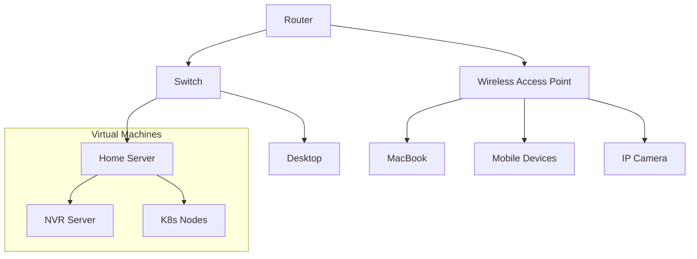

# Overview

The goal of my homelab is to set up a development environment that allows me to experiment quickly and cheaply without deploying to a public cloud service. I'd like my homelab to support VM creation and a Kubernetes cluster.

## Virtualization

I'm deploying [Proxmox](https://www.proxmox.com/en/) as my hypervisor. I have one device currently so no clustering or high availability configuration as of yet.

## My LAN

This is a map of my home network. I'd like to enhance this with firewall and VLAN details eventually.

