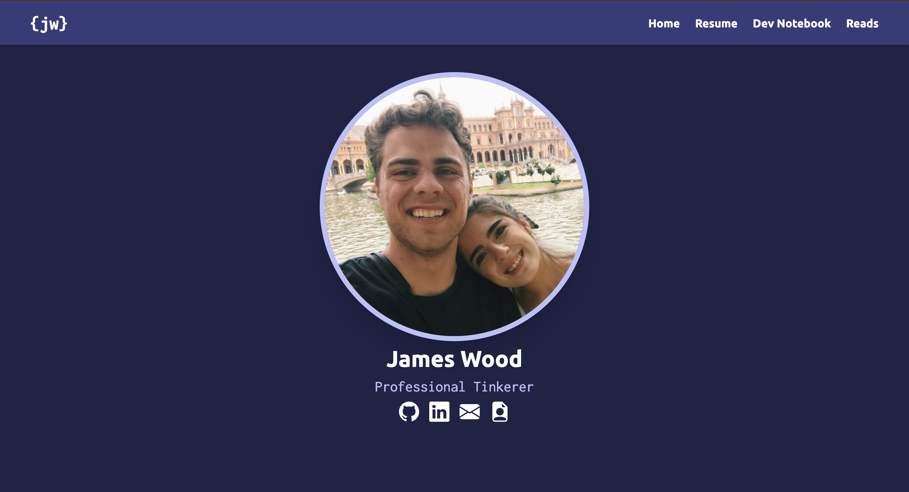
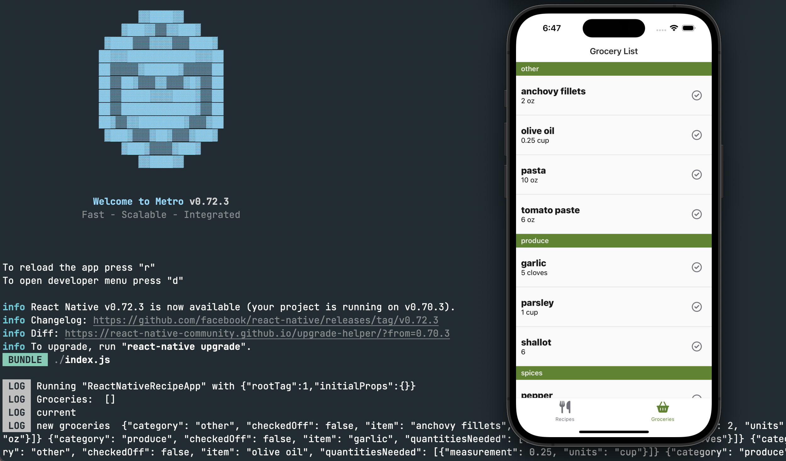
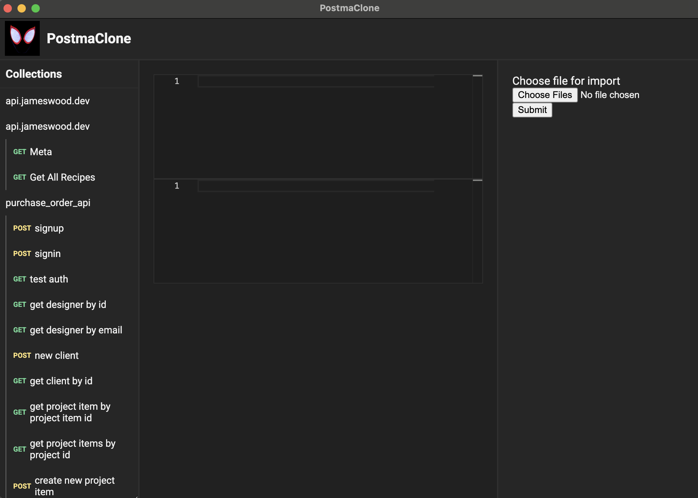
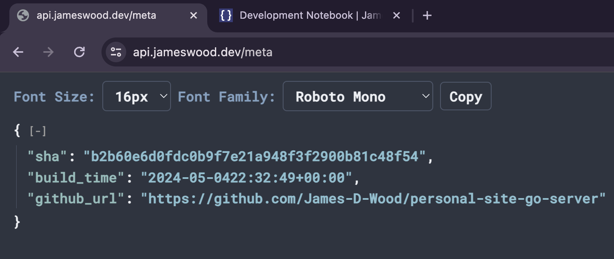

# Personal Projects

Hi! My name is James and I am a software developer who specializes in backend engineering. My work days are focused on designing and deploying scalable services that power what goes on behind the scenes of the companies I work at. My personal time is focused on exploring all the curiosities of programming outside of backend engineering. Here you will see a smattering of personal projects that cover my interests in developer tooling, mobile applications, front end for the web and low level programming. 

## Personal Site && Notebook

An exploration of React and Docusaurus tied to a basic backend service.

## iOS Recipe App

An exploration of Mobile App development.

## Post MaClone

An exploration of Electron for desktop applications.

## JSON Formatter Chrome Extension

An exploration of Chrome Extensions.

## Home Lab

An exploration of setting up a hypervisor for home hosting and managing virtual machines. 
