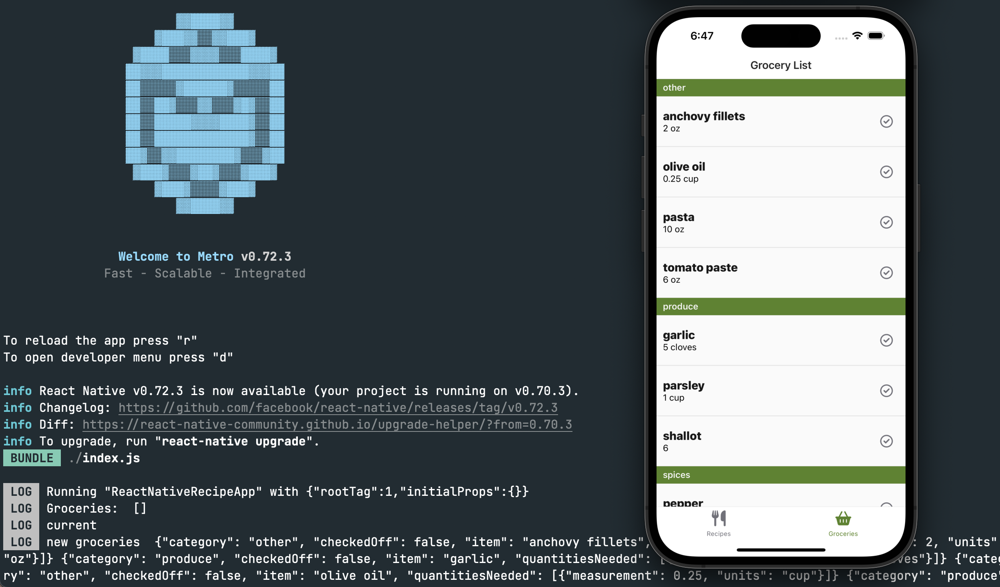

# Development Notebook

## July 22, 2023

A few months ago, I started development on a recipe app using React Native as a way to dip my toes into mobile development. My background is in web development, so React Native seemed like the natural choice to get a prototype up and running quickly. The purpose of the app is simply to provide a library of recipes that my friends and family can contribute to and share. It also includes a shopping list generator for weekly grocery runs. The first prototype took a couple of development sessions and my girlfriend and I were pretty happy with the results on our first couple trips to the market. Unfortunately, I need to reinstall the app to our phones every couple days after it expires. TestPilot seems to be the solution to more sustainable long running beta in the iOS ecosystem. Before I take that step though, I want to spend some time comparing what developing with Swift UI feels like. I have a bit of a background in Swift from college with the UIKit framework, so I figured I'd try a couple tutorials before deciding on a direction for my mobile client.


The grocery list view of the React Native app running with [Metro](https://facebook.github.io/metro/)

The course I am following is Sean Allen's [SwiftUI Fundamentals](https://seanallen.teachable.com/p/swiftui-fundamentals). His [free preview](https://www.youtube.com/watch?v=HXoVSbwWUIk) on YouTube was paced well for a developer with previous programming experience and explained decision making through refactorings which hooked me right away.


The above is a still of my version of the Weather App example from Sean Allen's introductory course.

### Interesting Code Snippets

```swift
struct Forecast {

    // highlight-start
    // binding property wrapper
    @Binding var isNight: Bool
    // highlight-end

    var dayOfWeek: WeekdayAbbreviation
    var temperature: Int
    var weather: WeatherType

    // highlight-start
    // read-only computed property
    var icon: Image {
        switch weather {
        case .clear:
            return isNight
                ? Image(systemName: "moon.stars.fill")
                : Image(systemName: "sun.max.fill")
        case .cloudy:
            return isNight
                ? Image(systemName: "cloud.moon.fill")
                : Image(systemName: "cloud.sun.fill")
        case .rainy:
            return isNight
                ? Image(systemName: "cloud.moon.rain.fill")
                : Image(systemName: "cloud.rain.fill")
        }
    }
    //highlight-end
}
```

#### @State and @Binding

SwiftUI includes the property wrapper `@State` to allow the user to define a property that
can be cascaded through the view hierarchy. When the value of this property changes, SwiftUI
will update the relevant views. This is very similar to state in React. One difference is that
the state propery can be passed normally for 1-way data binding or as a `@Binding` property to
allow for 2-way data binding.

Resources:

- https://developer.apple.com/documentation/swiftui/state
- https://developer.apple.com/documentation/swiftui/binding

#### Read-Only Computed Property

This syntax was very interesting to me. I must have stumbled across it on stack overflow as I was experimenting with how to best make the icon property dynamic but didn't understand how it was working. This syntax is known as a read only computed property in Swift, and essentially allows for providing a getter method in the form of the closure to be called when the property is referenced.

Another neat note was that I actually thought I had a bug in this code due to the lack of a default case in my switch statement. I went to add another weather value to the enum to try to break my implementation and found that Swift will actually catch this error at compile time which struck me as an impressive language feature.

Resources:

- https://docs.swift.org/swift-book/documentation/the-swift-programming-language/properties#Read-Only-Computed-Properties
- https://docs.swift.org/swift-book/documentation/the-swift-programming-language/closures
